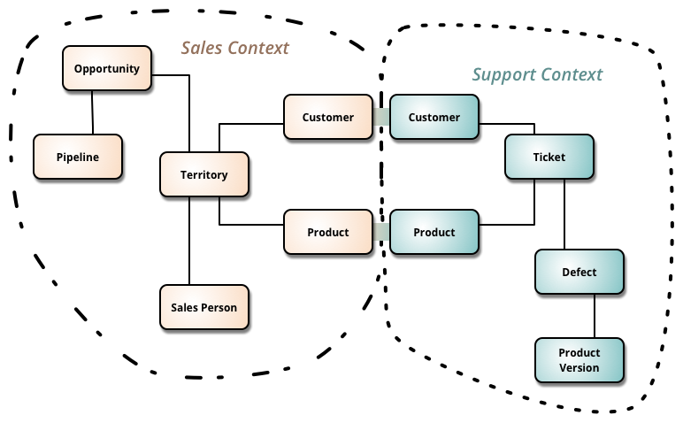
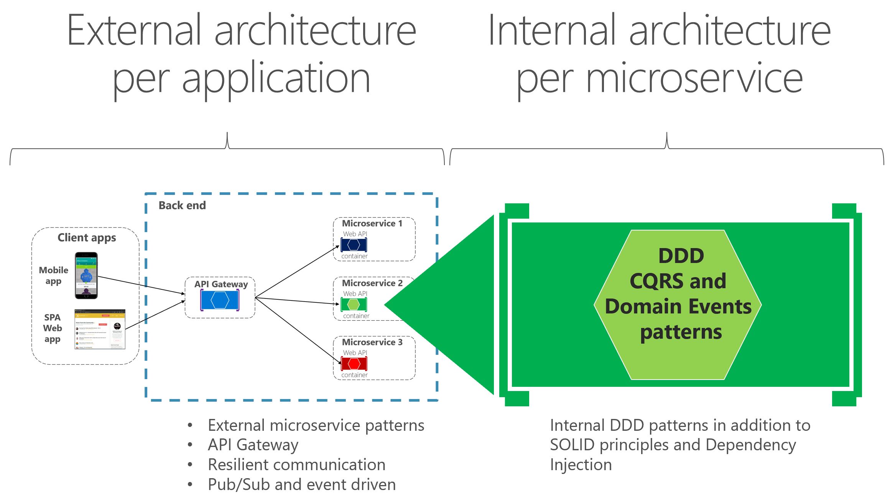

## ✅ **What is a Bounded Context?**

A **Bounded Context** is a **clear boundary** within your system where a **specific meaning of data and terms** is valid.

Think of it like this:

> The same word can mean different things in different departments — and that’s okay, as long as each department (context) is kept separate.

---

### 🔍 Example:

* In an **eCommerce system**:

  * In the **Order context**, “Customer” means someone who places an order.
  * In the **Support context**, “Customer” means someone who raised a ticket.

They both use the word **Customer**, but their **behavior and data** are different.

---

### 🧠 Why it matters?

* Helps teams avoid confusion and conflicts.
* Each context can evolve independently.
* It's a key concept in **Domain-Driven Design (DDD)** and **microservices**.

---
## ✅ What is Domain-Driven Design (DDD)?

**Domain-Driven Design (DDD)** is a way of building software that focuses on the **real-world problem (domain)** your software is trying to solve — and involves **close collaboration with domain experts**.

---

### 🔍 Definition:

> DDD is about **designing your software based on the business**, not just the technology.

---

### 🧱 Key Ideas:

1. **Domain** – The area your software is solving (e.g., banking, e-commerce, healthcare).
2. **Entities** – Things that have an identity (like `Customer`, `Order`).
3. **Value Objects** – Objects that don’t have identity, only value (like `Address`, `Money`).
4. **Aggregates** – A group of objects treated as one unit (like `Order` with `OrderItems`).
5. **Repositories** – Interfaces to fetch and store aggregates.
6. **Services** – Business logic that doesn't naturally fit in an entity/value object.
7. **Bounded Context** – A clearly defined boundary within the system where terms and models have specific meaning.
8. **Ubiquitous Language** – A shared language between developers and business users that everyone understands.

---

### 🎯 Why use DDD?

* Makes software **closer to business reality**.
* Reduces miscommunication between devs and domain experts.
* Encourages **clean architecture** and **better code organization**.

---

### 🧠 In short:

> DDD helps you build **software that speaks the business language**, and keeps the complexity where it belongs — **in the business rules**, not in the plumbing.

---

## ✅ What is **Service Granularity** in Microservices?

**Service Granularity** refers to **how big or small** a microservice should be — in terms of **scope, responsibilities, and size**.

---

### 🔍 Simple Definition:

> It's about finding the **right size** for a microservice — not too big (like a monolith) and not too small (like nano-services).

---

### 🧱 Two Types:

1. **Coarse-Grained Service**

   * Has **more responsibilities**.
   * Covers **broader business functionality**.
   * Fewer services to manage, but **less flexibility**.
   * Example: A single `OrderService` handles creation, tracking, and billing.

2. **Fine-Grained Service**

   * Has **very specific responsibility**.
   * More services, each doing **only one thing**.
   * Greater flexibility and scalability, but **more complexity** in communication.
   * Example: Separate services like `OrderCreationService`, `OrderTrackingService`, `BillingService`.

---

### 🎯 How to decide the granularity?

Ask:

* Does the service handle **one clear business function**?
* Can it be **owned, deployed, and scaled independently**?
* Will splitting or combining services help **reduce communication overhead**?
* Do services often change together? If yes, consider merging.

---

### 🧠 Rule of Thumb:

> **A service should do one thing well**, and should **not be so small that it causes excessive inter-service communication**.

