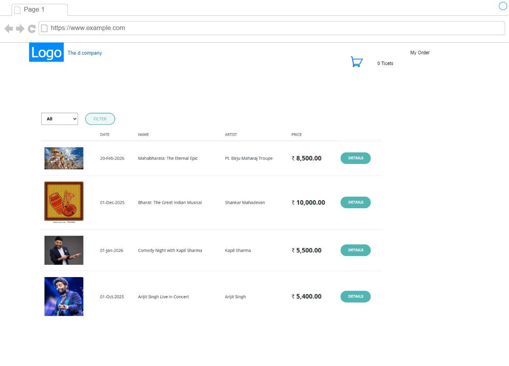
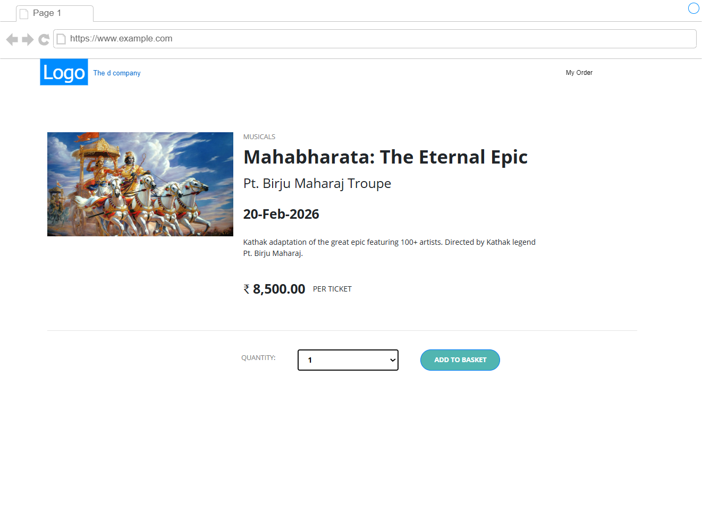
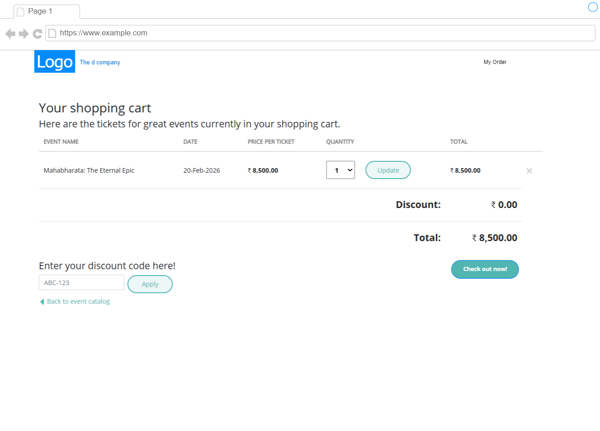

# 2.2 Business Case

## 📘 Business Case: **EvenTicket – Event Booking Microservice Platform**

### 🎯 Project Overview

**EvenTicket** is an online platform that allows users to **search, book, and manage tickets** for events like concerts, sports, workshops, and theater shows. The system should handle **high traffic**, support **real-time availability**, and ensure **secure payment processing**.

### ✅ Functional Requirements (FR)

1. **User Management**

   * Register/login (with email/password or social login)
   * View profile, booking history

2. **Event Management**

   * Event organizers can create, update, and delete events
   * Each event includes details (title, date, venue, tickets, price)

3. **Event Search & Discovery**

   * Users can search by category, location, or date
   * Filter by availability, price range

4. **Ticket Booking**

   * Book one or more tickets
   * Lock ticket inventory temporarily during booking
   * Handle booking timeout and expiry

5. **Payments**

   * Integrate with a payment gateway (mocked for now)
   * Generate order confirmation on successful payment

6. **Notifications**

   * Send booking confirmation via email/SMS
   * Notify users of event updates/cancellations

7. **Admin Portal (optional)**

   * View reports, manage users/events/bookings

### 🚫 Non-Functional Requirements (NFR)

| Category           | Requirement                                                                |
| ------------------ | -------------------------------------------------------------------------- |
| **Scalability**    | System must handle 1000+ concurrent bookings per second                    |
| **Availability**   | 99.9% uptime SLA                                                           |
| **Performance**    | API response time < 500ms for most operations                              |
| **Security**       | Secure API access (OAuth2), input validation, payment encryption           |
| **Logging**        | Centralized logging and error tracking for all services                    |
| **Monitoring**     | Real-time metrics and alerts using Prometheus + Grafana (or Azure Monitor) |
| **Data Integrity** | Prevent double-booking of tickets using locking or event-driven updates    |
| **Resilience**     | Use retries and circuit breakers for dependent services                    |
| **Extensibility**  | Should support new features like discounts, coupons, loyalty programs      |

### 🧱 Microservices (Suggested)

| Service Name             | Responsibilities                                            |
| ------------------------ | ----------------------------------------------------------- |
| **Event Service**        | Create/manage event listings                                |
| **Payment Service**      | Integrate with external payment gateway                     |
| **Gateway API**          | Entry point to all APIs, handles routing and authentication |

### 📩 Event-Driven Architecture (Example Events)

| Event               | Producer        | Consumers              |
| ------------------- | --------------- | ---------------------- |
| `EventCreated`      | Event Service   | Search Service         |
| `BookingExpired`    | Booking Service | Ticket Release Handler |

### 🛠 Tech Stack (Example)

* **Backend**: .NET Core (Web API), Azure Service Bus for events
* **Frontend**: .NET Core (MVC)
* **Database**: SQL Server / CosmoDb (per service)
* **API Gateway**: YARP (for routing)
* **Containerization**: Docker, Docker Compose for local dev
* **Deployment**: Kubernetes (minikube/kind for dev), or Azure AKS or GCHR
* **CI/CD**: GitHub Actions 
* **Monitoring**: Prometheus, Grafana, ELK Stack

### 🧪 Testing Strategy

* Unit tests for services
* Integration tests for inter-service communication
* Load testing using **k6 or JMeter**

### 📈 Future Enhancements

* User reviews & ratings
* QR code-based digital ticketing
* Loyalty rewards system
* Integration with calendar/reminder services
* Event sponsorships and advertisements

## Wireframe 

## Context Diagram

## Module Decomposition Diagram

## Component Diagram

## Deployment Diagram

## How System works

## 🤔 Why Microservices for **EvenTicket**?

### 🎯 Business Case: Event Booking Platform

EvenTicket needs to support a **variety of independent but connected features** — user management, event discovery, ticket booking, payments, notifications, etc. Microservices architecture is well-suited for this type of system.

## ✅ Benefits of Microservices for EvenTicket

### 1. **Separation of Concerns**

Each service handles **only one responsibility**:

* `UserService` manages users.
* `BookingService` handles ticket availability.
* `PaymentService` focuses on transactions.

➡️ This makes the system easier to **understand, maintain, and evolve**.

### 2. **Scalability**

* Some services like `SearchService` and `BookingService` might get **more traffic**.
* Microservices allow **independent scaling** — scale only the services that need it, saving cost and improving performance.

### 3. **Technology Flexibility**

* You can build services in **different languages** if needed (e.g., .NET for Booking, Node.js for Notification).
* Allows teams to choose the **best tools for each job**.

### 4. **Faster Development & Deployment**

* Teams can work **independently** on different services.
* Deploy a new version of `PaymentService` without touching `EventService`.

➡️ Enables **faster feature rollout** and **reduced risk** of breaking the whole system.

### 5. **Fault Isolation**

* If `NotificationService` fails, **booking still works**.
* Reduces the risk of **system-wide failure**.

### 6. **Event-Driven Capabilities**

* Microservices fit naturally into an **event-driven system**.
* Example: After a successful booking, `BookingService` can emit a `TicketBooked` event → other services like Notification or Analytics can **react asynchronously**.

### 7. **Easy to Extend**

* Adding new features like coupons, loyalty points, or QR code validation?
* Just add new services without changing the existing ones.

### 🛠️ Microservices Match the Business Complexity

EvenTicket involves multiple domains:

* Users
* Events
* Orders/Bookings
* Payments
* Notifications

Each has its own **business logic**, **data model**, and **scaling requirements** — making it a **perfect candidate for microservices**.

### Port numbers for Microservice

Microservices |  Local Env | Docker Env | Docker Inside
|---|---|---|---|
Event Catalog  |  5000-5050 | 6000-6050 |8080-8081 |
Shopping  |  5001-5051 | 6001-6051 |8080-8081 |
Discount  |  5002-5052 | 6002-6052 |8080-8081 |
Ordering  |  5003-5053 | 6003-6053 |8080-8081 |
