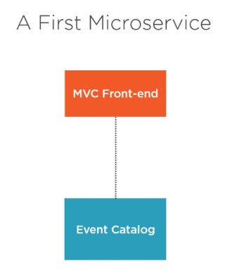
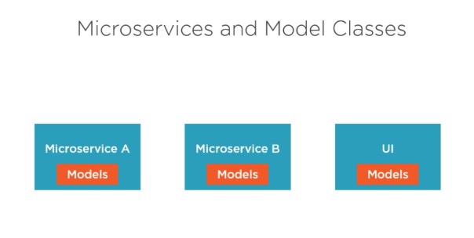
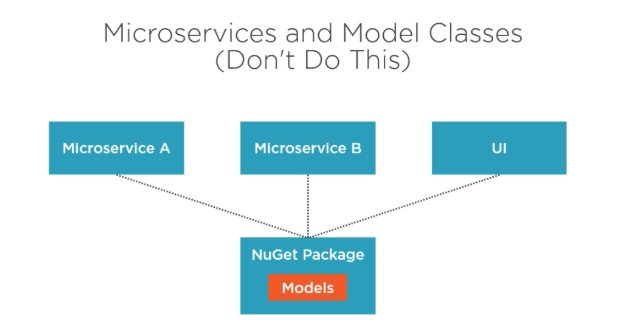
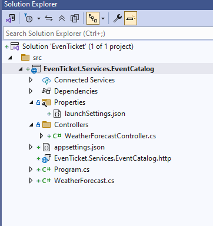

## 🎬 Building First Microservice – `EventCatalogService`

The **Event Catalog Service** will be responsible for managing the list of events that users can view and search.

### 🧱 1. **Responsibilities of EventCatalogService**

| Feature                      | Description                                   |
| ---------------------------- | --------------------------------------------- |
| Get Event by ID              | View full details of a specific event         |
| List All Events              | Public API to list/search all upcoming events |
| Get Category              | Public API to list all Category |

### ⚙️ 2. **Tech Stack**

| Layer     | Tech                  |
| --------- | --------------------- |
| Language  | C# (.NET 9)           |
| Framework | ASP.NET Core Web API  |
| DB        | SQL Server            |
| API Docs  | Swagger /Scalar / http / OpenAPI     |
| Container | Docker                |
| ORM       | EF Core       |








### 🛠️ 3. **Core Models (Example)**

```csharp
public class Event
{
    [Required]
    public Guid EventId { get; set; }
    public string Name { get; set; }
    public int Price { get; set; }
    public string Artist { get; set; }
    public DateTime Date { get; set; }
    public string Description { get; set; }
    public string ImageUrl { get; set; }
    public Guid CategoryId { get; set; }
    public Category Category { get; set; }
}

public class Category
{
    public Guid CategoryId { get; set; }
    public string Name { get; set; }
    public List<Event> Events { get; set; }
}
```

### 🔗 4. **API Endpoints (OpenAPI Spec)**

| Method | Endpoint           | Description      |
| ------ | ------------------ | ---------------- |
| GET    | `/api/events`      | Get all events   |
| GET    | `/api/events/{id}` | Get event by ID  |
| GET    | `/api/Category`     | Get all categories   |


### 🛠️ Creating the EvenTicket Solution

#### 📦 1. Create the Solution

```bash
dotnet new sln -n EvenTicket
```

This creates a `.sln` file named `EvenTicket.sln`.

#### 🧱 2. Create the Event Catalog Web API Project

```bash
dotnet new webapi -n EvenTicket.Services.EventCatalog --use-controllers -o src/EvenTicket.Services.EventCatalog
```

* `--use-controllers` → uses traditional MVC controller pattern.
* `-n` or `--name`	Sets the project name (and folder name).
* `-o` or `--output`	Specifies the output directory (default: current folder).
* `--no-https`	Disables HTTPS (not recommended for production).
* `--framework`	Targets a specific .NET version (e.g., net9.0).
* `--use-controllers`	Uses controllers instead of minimal APIs.
* `--no-openapi` Disables OpenAPI (Swagger) support.

> This creates the microservice project inside the `src` folder.


#### 🧩 3. Add the Project to the Solution

```bash
dotnet sln add src/EvenTicket.Services.EventCatalog/EvenTicket.Services.EventCatalog.csproj
```

This adds your new microservice project to the solution file.

#### ✅ 4. Verify Solution Structure

```bash
dotnet sln list
```

Output should confirm the project is included in the solution.

### 📁 Project Structure after creating project



## Getting Started with Code – EventCatalog Microservice

### 🛠 Step 1: Disable Nullable in .csproj

```xml
 <PropertyGroup>
   <TargetFramework>net9.0</TargetFramework>
   <Nullable>disable</Nullable>
   <ImplicitUsings>enable</ImplicitUsings>
 </PropertyGroup>
```

#### 🔍 What This Does:
* <TargetFramework>: Specifies .NET 9.0 as the target framework.
* <Nullable>disable</Nullable>: Disables nullable reference type checking, which avoids compiler warnings for uninitialized non-nullable reference types.
* <ImplicitUsings>enable</ImplicitUsings>: Automatically includes commonly used using directives to reduce boilerplate.


> 👉 Why: Keeping things simple for demo and learning purposes — especially for beginners not ready to deal with nullable warnings.
Then create two class file inside Entities folder

### 📁 Step 2: Define Domain Models (Entities)

```cs
public class Category
{
    public Guid CategoryId { get; set; }
    public string Name { get; set; }
    public List<Event> Events { get; set; }
}

public class Event
{
    [Required]
    public Guid EventId { get; set; }
    public string Name { get; set; }
    public int Price { get; set; }
    public string Artist { get; set; }
    public DateTime Date { get; set; }
    public string Description { get; set; }
    public string ImageUrl { get; set; }
    public Guid CategoryId { get; set; }
    public Category Category { get; set; }
}
```

#### 🔍 What This Does:

* Models your core business entities: Category and Event.
* Demonstrates a one-to-many relationship: A Category can have many Events.
* Includes required fields like Name, Artist, Price, and Date.

> 👉 Why: Clean and simple structure to store and retrieve event listings grouped by category.

### 🧠 Step 3: Create DbContext for EF Core


```cs
public class EventCatalogDbContext(DbContextOptions<EventCatalogDbContext> options, ILogger<EventCatalogDbContext> logger) : DbContext(options)
{
    public DbSet<Category> Categories { get; set; }
    public DbSet<Event> Events { get; set; }
}
```

### 🧾 Step 4: Create DTOs (Data Transfer Objects)


```cs
public record CategoryDto
{
    public Guid CategoryId { get; set; }
    public string Name { get; set; }
}

public record EventDto
{
    public Guid EventId { get; set; }
    public string Name { get; set; }
    public int Price { get; set; }
    public string Artist { get; set; }
    public DateTime Date { get; set; }
    public string Description { get; set; }
    public string ImageUrl { get; set; }
    public Guid CategoryId { get; set; }
    public string CategoryName { get; set; }
}
```

async program

## Differenence between Class and Record

In C#, both **class** and **record** are used to define types, but they serve different purposes and have distinct behaviors.

### 1. **Class**:

* A **class** is a reference type.
* Objects created from a class are stored on the heap, and assignment copies references.
* Best suited for defining objects with behavior (methods) and mutable state.
* Requires explicit implementation for equality comparison.
* Example:

  ```csharp
  class Person
  {
      public string Name { get; set; }
      public int Age { get; set; }
  }

  var person1 = new Person { Name = "Alice", Age = 30 };
  var person2 = person1; // Both point to the same object.
  person2.Age = 35;
  Console.WriteLine(person1.Age); // Output: 35
  ```

### 2. **Record**:

* A **record** is also a reference type (by default), but it is **immutable** by design.
* Introduced in C# 9.0 for defining **data-centric** types.
* Comes with built-in value-based equality.
* Supports concise **with-expressions** for immutability.
* Example:

  ```csharp
  record Person(string Name, int Age);

  var person1 = new Person("Alice", 30);
  var person2 = person1 with { Age = 35 }; // Creates a new object
  Console.WriteLine(person1.Age); // Output: 30
  Console.WriteLine(person2.Age); // Output: 35
  ```

### 3. **Key Differences**:

| Feature          | Class                          | Record                       |
| ---------------- | ------------------------------ | ---------------------------- |
| **Type**         | Reference type                 | Reference type (by default)  |
| **Equality**     | Reference equality             | Value-based equality         |
| **Immutability** | Mutable by default             | Immutable by default         |
| **Use case**     | Best for objects with behavior | Best for data-centric models |
| **Copying**      | Manual copying needed          | Supports `with` expressions  |
| **Syntax**       | `class` keyword                | `record` keyword             |


**When to Use What?**

* Use **class** when you need behavior, state changes, or large mutable objects.
* Use **record** when you need immutable, value-like objects (e.g., DTOs, configuration settings).


  
## 🧠 Why Asynchronous Programming?

In traditional synchronous programming, **each line of code waits for the previous one to finish**. This becomes a bottleneck when the code performs I/O-bound tasks like:

* Calling external APIs
* Reading or writing files
* Database operations
* Sending emails

Example:

```csharp
var data = GetFromApi(); // waits for response
var file = File.ReadAllText("log.txt"); // waits for disk I/O
```

In high-load environments like web servers, this blocks valuable threads, limiting scalability. Instead, **async programming allows I/O to happen in the background**, letting the thread serve other requests.


## 🔑 Understanding `async` and `await`

The `async` and `await` keywords in C# are used to implement asynchronous methods. Think of `async` as a way to "mark a method for background execution" and `await` as "pausing without blocking".

### Basic Rules:

* A method must be marked `async` to use `await` inside it.
* An `async` method returns `Task`, `Task<T>`, or `ValueTask<T>` (avoid `void` unless it's for event handlers).

### Example:

```csharp
public async Task<string> FetchDataAsync()
{
    HttpClient client = new HttpClient();
    string json = await client.GetStringAsync("https://jsonplaceholder.typicode.com/todos/1");
    return json;
}
```

Here:

* `HttpClient.GetStringAsync` starts downloading the JSON in the background.
* `await` tells the method to "pause here and resume when done".

Behind the scenes, the compiler generates a state machine to manage this.

## 🚦 Synchronous vs Asynchronous

### 🔹 Synchronous File Read

```csharp
public string ReadFile()
{
    return File.ReadAllText("data.txt"); // Blocking
}
```

* Blocks the calling thread until the file is read.
* UI becomes unresponsive during this operation.

### 🔹 Asynchronous File Read

```csharp
public async Task<string> ReadFileAsync()
{
    return await File.ReadAllTextAsync("data.txt"); // Non-blocking
}
```

* Frees up the thread to do other work.
* Recommended for web servers and UI apps.


## 📦 Task-Based Asynchronous Pattern (TAP)

TAP is the standard for asynchronous programming in .NET. You’ll notice many modern .NET APIs return `Task` or `Task<T>`.

### Example with Delay:

```csharp
public async Task SimulateDelayAsync()
{
    Console.WriteLine("Starting delay...");
    await Task.Delay(3000); // 3-second non-blocking delay
    Console.WriteLine("Completed.");
}
```

This mimics real-world delays like network latency or slow APIs.

### Benefits of TAP:

* Easy chaining: `await FetchDataAsync().ContinueWith(...)`
* Exceptions propagate through `Task` (can use `try-catch`)
* Integrates seamlessly with ASP.NET Core, WinForms, and WPF


## 🔁 Async vs Parallel Programming

It’s common to confuse **asynchronous** with **parallel** programming.

| Concept      | Description                                             |
| ------------ | ------------------------------------------------------- |
| **Async**    | Non-blocking operations; uses single thread efficiently |
| **Parallel** | Multiple threads doing work at the same time            |

### Parallel Example:

```csharp
Parallel.For(0, 10, i =>
{
    Console.WriteLine($"Processing {i}");
});
```

### Async Example:

```csharp
public async Task RunInSequenceAsync()
{
    await Task.Delay(1000);
    Console.WriteLine("Done");
}
```

> Use async for I/O-bound tasks and parallel for CPU-bound tasks.

## 🧪 Real-World ASP.NET Core API Example

Let’s build a weather API using `async`/`await`.

```csharp
[ApiController]
[Route("api/[controller]")]
public class WeatherController : ControllerBase
{
    private readonly HttpClient _httpClient;

    public WeatherController(HttpClient httpClient)
    {
        _httpClient = httpClient;
    }

    [HttpGet("forecast")]
    public async Task<IActionResult> GetForecastAsync()
    {
        string url = "https://api.weatherapi.com/v1/current.json?key=demo&q=London";
        var data = await _httpClient.GetStringAsync(url);
        return Ok(data);
    }
}
```

### Why It Matters:

* The `await`ed API call doesn't block the request thread.
* Server can serve other requests during the wait.
* Scalable and efficient.
 