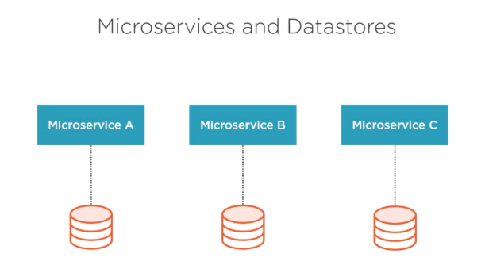
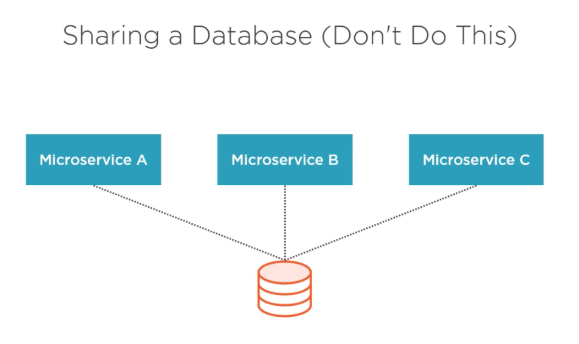
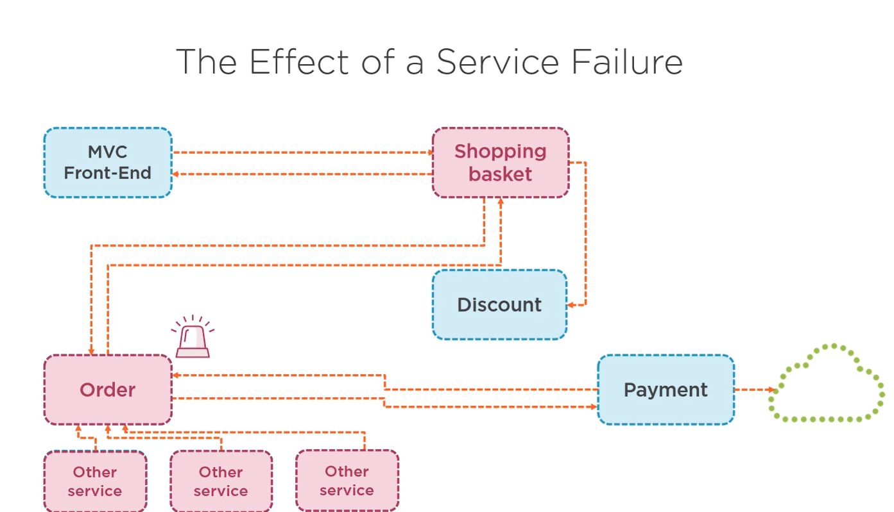

## 🎬 Adding Microservice – `ShoppingBasket`

The **Shopping Basket Service** will be responsible for managing the list of events that users can view and search.

### 🧱 1. **Responsibilities of EventCatalogService**

| Feature                      | Description                                   |
| ---------------------------- | --------------------------------------------- |


### ⚙️ 2. **Tech Stack**

| Layer     | Tech                  |
| --------- | --------------------- |
| Language  | C# (.NET 9)           |
| Framework | ASP.NET Core Web API  |
| DB        | SQL Server            |
| API Docs  | Swagger /Scalar / http / OpenAPI     |
| Container | Docker                |
| ORM       | EF Core       |





### 🛠️ 3. **Core Models (Example)**

```csharp
 public class Event
 {
     public Guid EventId { get; set; }
     public string Name { get; set; }
     public DateTime Date { get; set; }
 }

    public class BasketLine
    {
        public Guid BasketLineId { get; set; }

        [Required]
        public Guid BasketId { get; set; }

        [Required]
        public Guid EventId { get; set; }
        public Event Event { get; set; }

        [Required]
        public int TicketAmount { get; set; }

        [Required]
        public int Price { get; set; }

        public Basket Basket { get; set; }
    }

      public class Basket
  {
      public Guid BasketId { get; set; }

      [Required]
      public Guid UserId { get; set; }

      public Collection<BasketLine> BasketLines { get; set; }
  }
```

### 🔗 4. **API Endpoints (OpenAPI Spec)**

| Method | Endpoint           | Description      |
| ------ | ------------------ | ---------------- |

BasketLines


GET /api/baskets/{basketId}/basketlines
POST /api/baskets/{basketId}/basketlines
GET /api/baskets/{basketId}/basketlines/{basketLineId}
PUT /api/baskets/{basketId}/basketlines/{basketLineId}
DELETE /api/baskets/{basketId}/basketlines/{basketLineId}


Baskets


GET  /api/baskets/{basketId}
POST  /api/baskets

### 🛠️ Creating the ShoppingBasket Solution

#### 🧱 2. Create the Shopping Basket Web API Project

```bash
dotnet new webapi -n EvenTicket.Services.ShoppingBasket --use-controllers -o src/EvenTicket.Services.ShoppingBasket
dotnet sln add src/EvenTicket.Services.ShoppingBasket/EvenTicket.Services.ShoppingBasket.csproj
dotnet sln list
```





Here we have to pass unnecessary property which events service can be converted into graphql