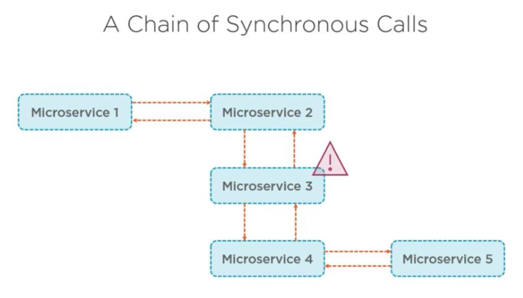
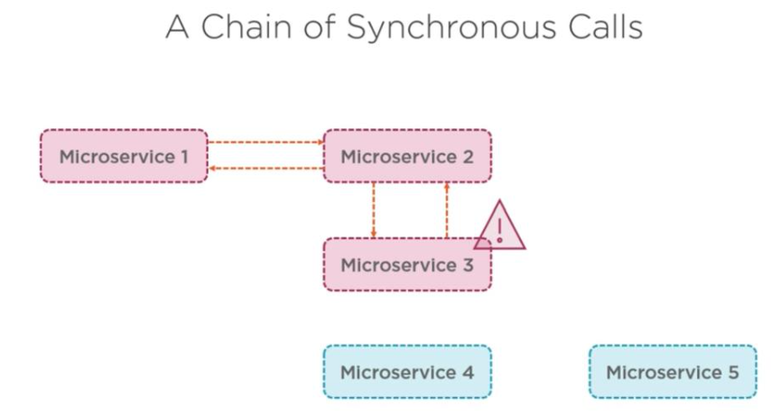
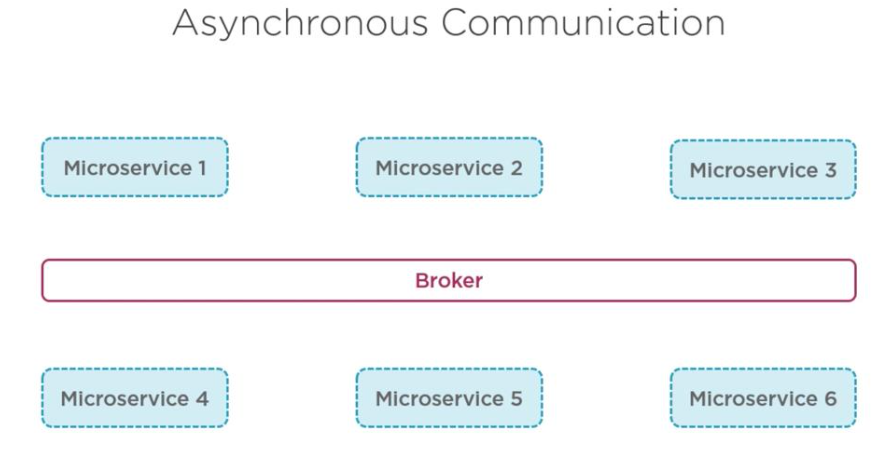
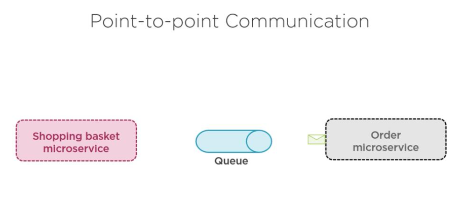

## Adding Asynchronous communication

Why Asynchrous communication, befor that will see disadvantages of syncrhrous communication.

### Disadvantages of Synchronous

* Tight coupling
* Bottleneck in system
* One to many
* Changes are hard
* Error difficult to catch




Asynchrous communication will solve a lot of above issue 







```bash
dotnet new classlib -n EvenTicket.Infrastructure.Messages -o src/BuildingBlocks/Infrastructure/EvenTicket.Infrastructure.Messages
dotnet new classlib -n EvenTicket.Infrastructure.MessagingBus -o src/BuildingBlocks/Infrastructure/EvenTicket.Infrastructure.MessagingBus

dotnet sln add src/BuildingBlocks/Infrastructure/EvenTicket.Infrastructure.Messages/EvenTicket.Infrastructure.Messages.csproj
dotnet sln add src/BuildingBlocks/Infrastructure/EvenTicket.Infrastructure.MessagingBus/EvenTicket.Infrastructure.MessagingBus.csproj
dotnet sln list
```


Ordering service

```bash
dotnet new webapi -n EvenTicket.Services.Ordering --use-controllers -o src/EvenTicket.Services.Ordering
dotnet sln add src/EvenTicket.Services.Ordering/EvenTicket.Services.Ordering.csproj
dotnet sln list
```
