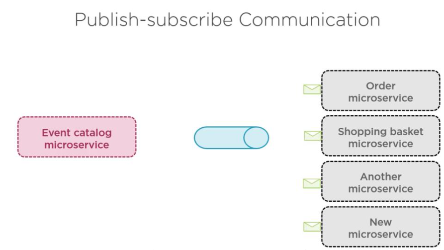

## Adding Asynchronous communication

Why Asynchrous communication, befor that will see disadvantages of syncrhrous communication.

### Disadvantages of Synchronous

* Tight coupling
* Bottleneck in system
* One to many
* Changes are hard
* Error difficult to catch


Asynchrous communication will solve a lot of above issue 





```bash
dotnet new classlib -n EvenTicket.Infrastructure.Messages -o src/BuildingBlocks/Infrastructure/EvenTicket.Infrastructure.Messages
dotnet new classlib -n EvenTicket.Infrastructure.MessagingBus -o src/BuildingBlocks/Infrastructure/EvenTicket.Infrastructure.MessagingBus

dotnet sln add src/BuildingBlocks/Infrastructure/EvenTicket.Infrastructure.Messages/EvenTicket.Infrastructure.Messages.csproj
dotnet sln add src/BuildingBlocks/Infrastructure/EvenTicket.Infrastructure.MessagingBus/EvenTicket.Infrastructure.MessagingBus.csproj
dotnet sln list
```


Ordering service

```bash
dotnet new webapi -n EvenTicket.Services.Ordering --use-controllers -o src/EvenTicket.Services.Ordering
dotnet sln add src/EvenTicket.Services.Ordering/EvenTicket.Services.Ordering.csproj
dotnet sln list
```


## Event and messages


### What is an **Event**?

An **event** is a **fact** or **thing that has happened** in a system.

> It's a record of **something that occurred** in the past.

####  Example:

* "OrderPlaced"
* "UserRegistered"
* "PaymentFailed"

These are **immutable**, meaning once they happen, they don’t change.

### What is a **Message**?

A **message** is a **piece of data sent from one service to another** to communicate something — and it may **contain an event**.

> Messages are how services **talk to each other** — either by **sending commands** or **publishing events**.

#### Types of Messages:

* **Event message** – “An order was placed.”
* **Command message** – “Create an invoice.”
* **Query message** – “Get order status.”

##  Event vs Message (Side by Side)

| Aspect     | Event                               | Message                          |
| ---------- | ----------------------------------- | -------------------------------- |
| What it is | A record of something that happened | A communication between services |
| Direction  | Usually one-way (publish)           | One-way or request-response      |
| Example    | "OrderPlaced"                       | "CreateInvoiceCommand"           |
| Nature     | Passive (just notifies)             | Active (asks for something)      |

## Summary:

* An **event** says: “Something happened.”
* A **message** says: “Here’s some info for you.”

In **event-driven systems**, services **emit events** and **consume events** using messages.

### Different options for event driven arch

* Azure service bus
* RabbitMQ
and other

## Setting up Azure service bus

check deployment folder