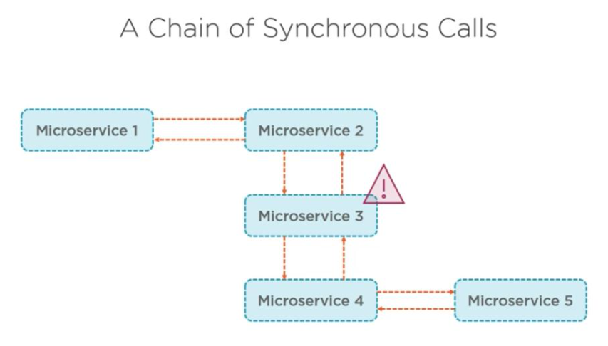
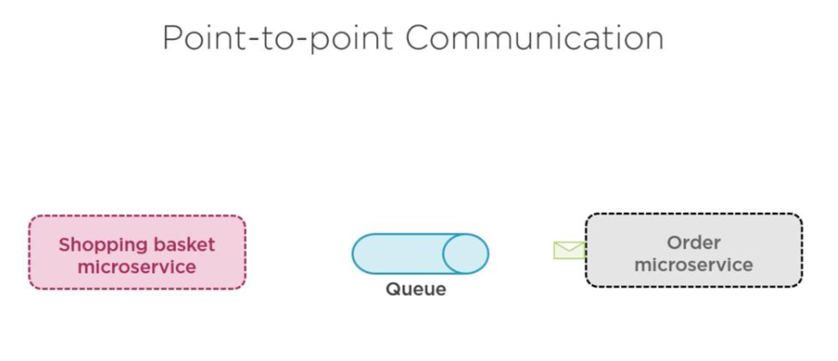

## Adding Asynchronous communication

Why Asynchrous communication, befor that will see disadvantages of syncrhrous communication.

### Disadvantages of Synchronous

* Tight coupling
* Bottleneck in system
* One to many
* Changes are hard
* Error difficult to catch

Asynchrous communication will solve a lot of above issue 

page num -93