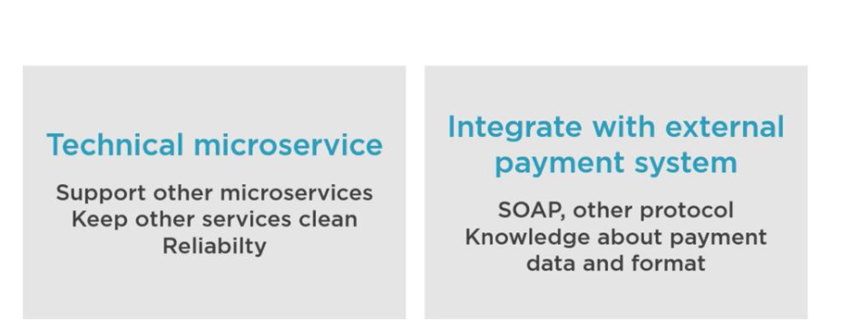
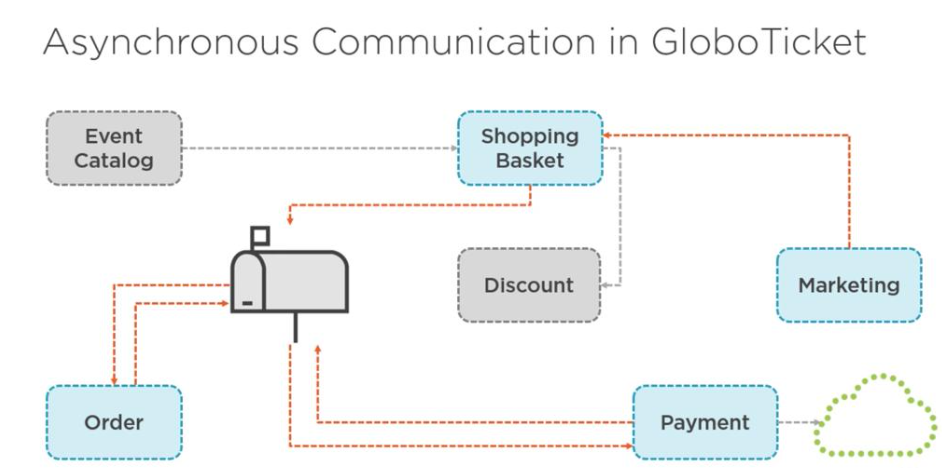

## Adding Background service

### Adding payment service



### Data flow 




Create Payment service

```bash
dotnet new webapi -n EvenTicket.Services.Payment --use-controllers -o src/Services/EvenTicket.Services.Payment

dotnet sln add src/Services/EvenTicket.Services.Payment/EvenTicket.Services.Payment.csproj


dotnet new webapi -n External.PaymentGateway --use-controllers -o src/Fake/External.PaymentGateway

dotnet sln add src/Fake/External.PaymentGateway/External.PaymentGateway.csproj

dotnet sln list
```


### **High-Level Use Case**

1. **Order Service** → sends a message to **OrderPaymentRequestTopic** requesting payment.
2. **This ServiceBusListener** picks up the message:

   * Reads order & card details.
   * Calls the payment gateway to process the payment.
   * Marks the message as completed.
3. **Publishes the payment result** to **OrderPaymentUpdatedTopic**, which other services (like Order Service) can consume to update the order status.
