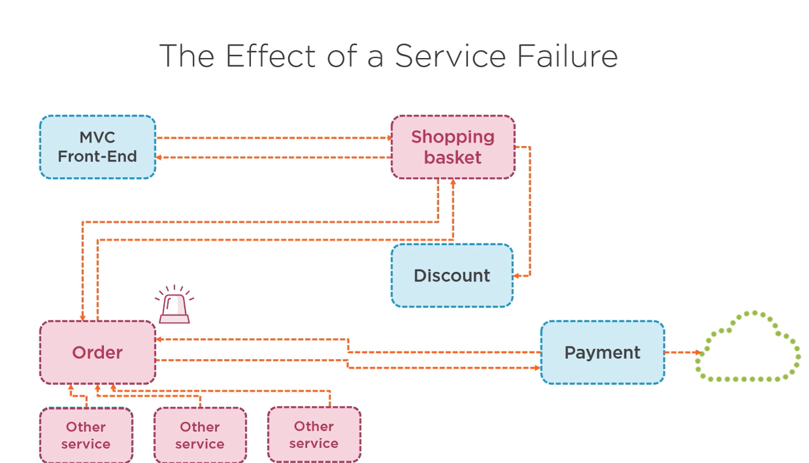

## 2.8-Making-Microservices-more-resilient

In microservices architecture, the term resilient (or resilience) refers to a system's ability to withstand failures, recover quickly, and continue functioning correctly even when some of its components fail or face unexpected issues.

Because microservices are distributed systems, failures are inevitable—network issues, service crashes, slow responses, or resource exhaustion can happen. A resilient microservice ensures that these failures do not cascade and bring down the entire system.




### Common issues


### Improving service resiliency

* Asynchronous communication
* Retry with expoental backoff 
    * Automatically retry failed requests with exponential backoff.
* Circuit Breaker Pattern

### **What is Circuit Breaker Pattern?**

The Circuit Breaker Pattern is a **resilience pattern** in microservices that **stops repeatedly calling a failing service** and allows it **time to recover**.

Think of it **like an electric circuit breaker in your house**:

* When there’s a **problem (short circuit)** → **Breaker trips (opens)** → **Stops electricity flow** to protect the system.
* After some **time**, it **tries again** to see if the problem is fixed.

In microservices:

* If **Service A** keeps calling **Service B**, and B keeps **failing or is too slow**, the **circuit breaker “opens”** and **stops requests** to B for a while.
* This **prevents overloading** B and **frees up A to handle other requests**.

#### **How It Works (3 States)**

1. **Closed (Normal)** 

   * Calls are working fine.
   * Service A → Service B works normally.

2. **Open (Problem Detected)** 

   * Too many failures happen.
   * Circuit “opens” and **stops sending requests** to B.
   * A can **fallback** instead (e.g., show cached data).

3. **Half-Open (Testing)**

   * After some wait time, the breaker **allows a few test requests** to B.
   * If B responds successfully → **Circuit closes (back to normal)**.
   * If B still fails → **Circuit stays open** longer.

#### **Simple Real-World Example**

* **Order Service → Payment Service**
* Payment Service is **down**.
* If we **keep calling it**, it will:

  1. Waste network resources
  2. Slow down Order Service
  3. Possibly **crash the whole app**

**With Circuit Breaker:**

* After 3 continuous payment failures → **Breaker opens**.
* Order Service **stops calling Payment Service** for 30 seconds.
* It **marks orders as “Payment Pending”** instead (fallback).
* After 30 seconds → It **sends one test request** to Payment Service.
* If success → **Back to normal**.

#### **Benefits**

* **Prevents cascading failures**
* **Protects resources**
* **Gives time for failing service to recover**
* **Improves user experience** with fallbacks

### **What is Retry Pattern?**

The **Retry Pattern** is a **resilience pattern** where your service **automatically tries again** when a request to another service **fails due to a temporary problem**.

Think of it like **calling your friend on the phone**:

* If the **call doesn’t connect** (network issue),
* You **wait a little** and **try again**,
* Usually, the call works on the **second or third try**.

#### **How It Works**

1. Service A calls Service B.
2. If the **request fails** due to a **temporary issue** (like timeout, network glitch):

   * Service A **waits a bit**
   * Then **retries the request**
3. If it **succeeds**, all good.
4. If it **keeps failing after multiple retries**, you can **stop and fallback**.

#### **Important Things**

* **Don’t retry immediately** → use **Exponential Backoff**:

  * 1st retry after 1 second
  * 2nd retry after 2 seconds
  * 3rd retry after 4 seconds
* **Don’t retry forever** → Set a **max retry count**.
* Combine with **Circuit Breaker** to avoid overloading a failing service.

#### **Real-World Example**

Imagine **Order Service → Payment Service**:

1. Payment Service is **temporarily slow** due to high traffic.
2. Order Service **calls Payment API** → Timeout.
3. Retry Pattern says:

   * **Wait 1 second → Retry**
   * If still fails → **Wait 2 seconds → Retry again**
   * If succeeds → **Payment completed** ✅
   * If fails after 3 tries → **Fallback to “Payment Pending”** ❌

#### **Benefits**

* Handles **temporary failures automatically**
* Reduces **unnecessary errors to users**
* Works well with **transient network issues**


### **Common Problems Using HttpClient**

#### **1. Socket Exhaustion**

* If you **create a new `HttpClient` object for every request**, it **does not immediately release the TCP connection**.
* Each `HttpClient` instance **opens a new socket**.
* In high-traffic apps, this leads to:

  * **Too many open sockets**
  * **System.Net.Sockets.SocketException: Address already in use**
* This is called **socket exhaustion**.

**Example of bad usage:**

```csharp
public async Task<string> CallServiceAsync()
{
    using var client = new HttpClient(); // Creating per request
    return await client.GetStringAsync("https://example.com/api/data");
}
```

* Each call creates a **new socket**, which stays in **TIME\_WAIT** state after disposal.

#### **2. DNS Changes Are Ignored**

* Old `HttpClient` instances **cache DNS lookups**.
* If the **server IP changes** (like in **Kubernetes or cloud deployments**), your client **might still call the old IP**, causing failures.

#### **3. Performance Overhead**

* Continuously creating and disposing `HttpClient` objects is **expensive**.
* It **wastes memory and CPU** by repeatedly creating TCP connections instead of **reusing them**.

### **Correct Way to Use HttpClient**

#### **1. Use a Single Static HttpClient**

* Create **one `HttpClient` instance** and reuse it for the **entire app lifetime**.

```csharp
public class MyService
{
    private static readonly HttpClient _httpClient = new HttpClient(); // Reused

    public async Task<string> CallServiceAsync()
    {
        return await _httpClient.GetStringAsync("https://example.com/api/data");
    }
}
```

#### **2. Use HttpClientFactory**

* Introduced in **.NET Core 2.1** to **solve these problems**.
* Benefits:

  * **Manages connection pooling automatically**
  * **Avoids socket exhaustion**
  * **Supports DNS refresh**
  * **Easy to configure retries, circuit breakers with Polly**

**Example using `IHttpClientFactory`:**

```csharp
// Program.cs or Startup.cs
builder.Services.AddHttpClient("MyApiClient");

// Usage in service
public class MyService
{
    private readonly HttpClient _client;

    public MyService(IHttpClientFactory factory)
    {
        _client = factory.CreateClient("MyApiClient");
    }

    public async Task<string> CallServiceAsync()
    {
        return await _client.GetStringAsync("https://example.com/api/data");
    }
}
```

### **Summary of Problems**

1. **Socket exhaustion** – too many short-lived connections
2. **DNS refresh issues** – can fail in cloud/microservices
3. **Performance issues** – creating/discarding `HttpClient` is expensive

**Solution** → **Use `HttpClientFactory`** with **Polly** for retries, circuit breakers, and timeouts.


#### Example 

call this endpoint for retry logic
```c#
/api/paymentapprover/error
```

Implement in ExternalGatewayPaymentService.cs file

```c#
    
    public async Task<bool> PerformPayment(PaymentInfo paymentInfo)
    {
        try
        {
            var client = _httpClientFactory.CreateClient("ExternalGateway");
            var dataAsString = JsonSerializer.Serialize(paymentInfo);
            var content = new StringContent(dataAsString);
            content.Headers.ContentType = new MediaTypeHeaderValue("application/json");

            var response = await client.PostAsync(
                _configuration.GetValue<string>("ApiConfigs:ExternalPaymentGateway:Uri") + "/api/paymentapprover",
                content);

            if (!response.IsSuccessStatusCode)
                throw new ApplicationException($"Something went wrong calling the API: {response.ReasonPhrase}");

            var responseString = await response.Content.ReadAsStringAsync().ConfigureAwait(false);

            return JsonSerializer.Deserialize<bool>(responseString, new JsonSerializerOptions { PropertyNameCaseInsensitive = true });
        }
        catch (BrokenCircuitException ex)
        {
            // Handle circuit breaker open state
            throw new ApplicationException("Payment service is temporarily unavailable due to repeated errors. Please try again later.", ex);
        }
    }
```