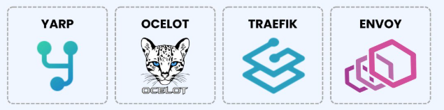

## 2.9-API Gateway With YARP Reverse Proxy

API Gateways with YARP (Yet Another Reverse Proxy) Reverse Proxy applying Gateway Routing Pattern


### What is an API Gateway?

API gateways are a crucial component in the architecture of microservice applications.

They act as a reverse proxy, routing incoming requests to the appropriate backend service and abstracting the underlying implementation details from the client.

One of the primary benefits of using an API gateway is the ability to manage and optimize the communication between different services, particularly when it comes to:

* Security
* Caching
* Rate limiting

It also provides a single endpoint for external clients to access, simplifying the integration process and minimizing the number of round trips required to retrieve data.

Some popular tools that can serve as API Gateways are:

* YARP
* Ocelot
* Traefik
* Envoy



There are also cloud gateways such as Azure API Gateway and Amazon API Gateway.


### What's The Difference Between an API Gateway And a Reverse Proxy?

#### Reverse proxy
A reverse proxy and an API gateway are similar concepts, but they serve different purposes.

A reverse proxy acts as an intermediary between clients and servers. The clients can only call the backend servers through the reverse proxy, which forwards the request to the appropriate server. It hides the implementation details of individual servers inside the internal network.

A reverse proxy is commonly used for:

* Load balancing
* Caching
* Security
* SSL termination

#### API gateway
An API gateway is a specific type of reverse proxy designed for managing APIs. It acts as a single entry point for API consumers to the various backend services.

The key characteristics of an API gateway are:

* Request routing and composition
* Request/response transformations
* Authentication and authorization
* Rate limiting
* Monitoring

Also, note that an API gateway can perform load balancing and other functionalities mentioned for reverse proxies.

Now let's see how to use a reverse proxy to implement an API gateway.


### Microsoft Reverse Proxy: YARP 

YARP is a lightweight, highly customizable reverse proxy solution developed by Microsoft, tailored for .NET applications. Designed to integrate seamlessly with .NET Core, making it easy to add to existing .NET projects. Simplify the routing of requests to different backend services, offering capabilities for request transformation, load balancing, and more.

YARP is not just another reverse proxy; it’s a testament to Microsoft’s commitment to open-source and .NET excellence. It’s designed to be lightweight, adaptable, and, most importantly, developer-friendly


### Key Features of YARP
* Customizable Routing: Direct traffic with pinpoint accuracy.
* Cross-Platform Freedom: Works seamlessly across Windows, Linux, and macOS.
* Protocol Prowess: Embraces gRPC, HTTP/2, and WebSockets for modern * applications.
* Performance: Built for speed and efficiency, ensuring low latency and * high throughput.
* Health Checks & Load Balancing: Keeps your services healthy and balanced.

### Exposing Microservices through YARP REST API Endpoints
Imagine YARP as the gateway that presents the diverse functionalities of our microservices under a unified front. It simplifies the client’s interaction by providing a single point of contact for various backend services. YARP will expose with microservices with putting microservice name as a prefix of internal uri’s.

Put microservice name as a prefix of internal uri’s
```plain text
{microservice_name}/{microservice_internal_url}
```

Microservices |  Local Env
|---|---|
Event Catalog | https://localhost:5050
Shopping basket | https://localhost:5051
Discount | https://localhost:5052
Ordering | https://localhost:5053
Payment | https://localhost:5054
External Payment Gateway | https://localhost:5055
API Gateway | https://localhost:5056


Microservices |  Local Env | Docker Env | Docker Inside
|---|---|---|---|
Event Catalog  |  5000-5050 | 6000-6050 |8080-8081 |
Shopping  |  5001-5051 | 6001-6051 |8080-8081 |
Discount  |  5002-5052 | 6002-6052 |8080-8081 |
Ordering  |  5003-5053 | 6003-6053 |8080-8081 |
Payment   |  5004-5054 | 6004-6054 |8080-8081 |
External Payment   |  5005-5055 | 6005-6055 |8080-8081 |
API Gateway   |  5006-5056 | 6006-6056 |8080-8081 |

### Project Folder Structure of YarpApiGateway
* Program.cs: Entry point of the application where Yarp and other services are configured.
* appsettings.json: Contains all the routing configurations for the microservices.


### Getting started

```
dotnet new webapi -n EvenTicket.Gateways.WebAPI --use-controllers -o src/Gateways/EvenTicket.Gateways.WebAPI

dotnet sln add src/Gateways/EvenTicket.Gateways.WebAPI/EvenTicket.Gateways.WebAPI.csproj
```


https://localhost:5056/ordering-service/api/order/user/920AC5CC-EE22-4135-8306-29C3789B5D58